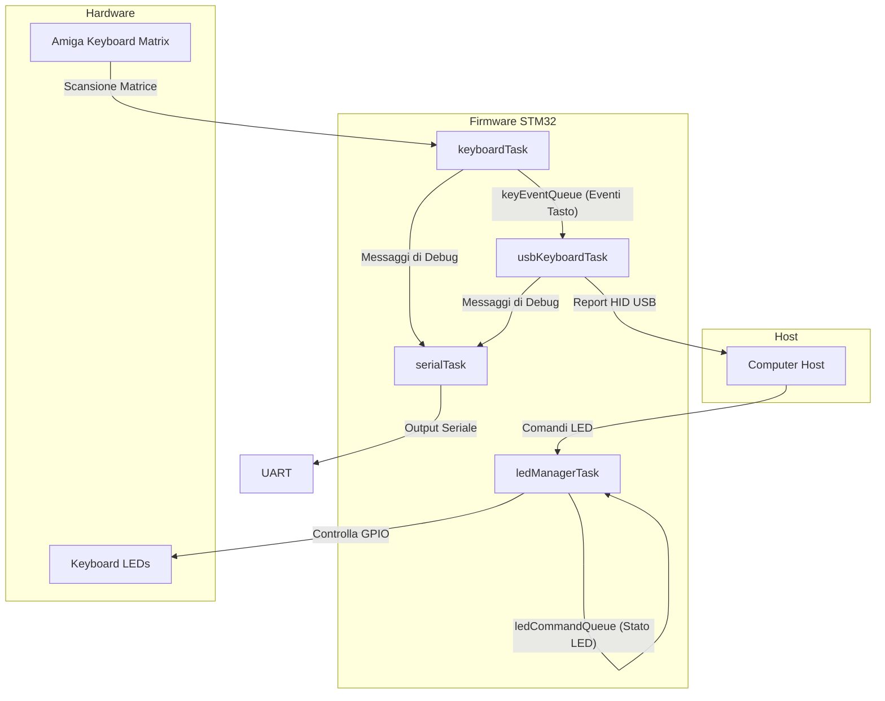
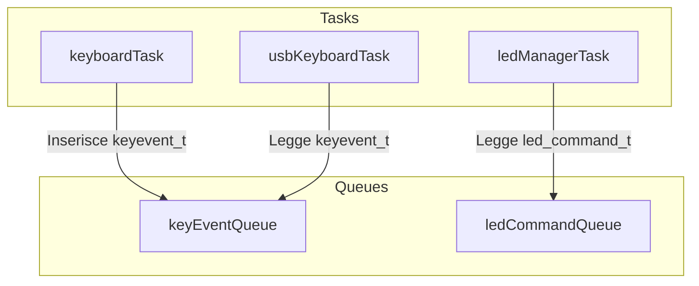

# Amiga USB Keyboard Firmware (amiga_usb_mx)

## Panoramica

Questo progetto trasforma una tastiera originale Amiga in un moderno dispositivo USB HID (Human Interface Device). Il firmware è progettato per essere eseguito su un microcontrollore STM32 (specificamente STM32F401xC), leggendo la matrice di tasti originale dell'Amiga e inviando gli eventi a un computer host tramite USB.

Il sistema è basato su FreeRTOS, che permette una gestione robusta e concorrente delle varie funzionalità del firmware.

## Architettura del Sistema

L'architettura del firmware è modulare e basata su task concorrenti che comunicano tramite code. Questo design disaccoppia le funzionalità principali, rendendo il sistema più stabile e facile da manutenere.

I componenti principali sono:
- **Matrix Scanner (`keyboardTask`)**: Si occupa della scansione della matrice della tastiera.
- **USB HID Handler (`usbKeyboardTask`)**: Gestisce la comunicazione USB con l'host.
- **LED Manager (`ledManagerTask`)**: Controlla i LED della tastiera (es. Caps Lock).
- **Serial Debugger (`serialTask`)**: Fornisce un'uscita di debug su UART.

### Diagramma di Flusso dell'Architettura

Il diagramma seguente illustra il flusso di dati tra i principali componenti del sistema.



## Gestione dei Task (FreeRTOS)

Il sistema operativo in tempo reale FreeRTOS è il cuore del firmware e gestisce quattro task principali.

### 1. `keyboardTask`
Questo è il task più critico. Il suo ruolo è scansionare continuamente la matrice della tastiera Amiga per rilevare la pressione e il rilascio dei tasti.
- **Funzionamento**: Esegue un loop di scansione sulle righe e colonne della matrice.
- **Debouncing**: Implementa un algoritmo di debouncing per filtrare i "rimbalzi" elettrici che si verificano alla pressione di un tasto.
- **Generazione Eventi**: Quando rileva un evento valido (pressione o rilascio), crea una struttura `keyevent_t` e la inserisce nella coda `keyEventQueue`.

### 2. `usbKeyboardTask`
Questo task si occupa di tutto ciò che riguarda la comunicazione USB con il computer host.
- **Funzionamento**: Rimane in attesa di nuovi eventi sulla coda `keyEventQueue`.
- **Traduzione Eventi**: Quando riceve un `keyevent_t`, lo traduce in un report USB HID standard.
- **Invio Report**: Invia il report HID all'host, notificando quale tasto è stato premuto o rilasciato.

### 3. `ledManagerTask`
Gestisce lo stato dei LED della tastiera (Caps Lock, Num Lock, Scroll Lock).
- **Funzionamento**: Attende comandi sulla coda `ledCommandQueue`.
- **Comunicazione USB**: Riceve dall'host USB i comandi per cambiare lo stato dei LED.
- **Controllo GPIO**: Aggiorna lo stato dei pin GPIO collegati ai LED fisici sulla tastiera.

### 4. `serialTask`
Fornisce un meccanismo di logging e debug non bloccante.
- **Funzionamento**: Attende messaggi di testo su una coda dedicata (`serialQueue`).
- **Output UART**: Quando riceve un messaggio, lo invia tramite la periferica UART, permettendo il debug senza interferire con le tempistiche dei task più critici.

## Comunicazione tra Processi (IPC)

La comunicazione tra i task è gestita interamente tramite le code di FreeRTOS, garantendo un'architettura pulita e disaccoppiata.



### Strutture Dati delle Code

- **`keyEventQueue`**: Utilizza la struttura `keyevent_t` per rappresentare un evento di un tasto.

  ```c
  /* key event from keyboard.h */
  typedef struct {
      keypos_t key;     // Posizione (riga, colonna) del tasto
      bool     pressed;   // true se premuto, false se rilasciato
      uint16_t time;      // Timestamp dell'evento
  } keyevent_t;
  ```

- **`ledCommandQueue`**: Utilizza la struttura `led_command_t` per i comandi dei LED.

  ```c
  /* LED command from keyboard_queues.h */
  typedef struct {
      uint8_t led_status; // Bitmap dello stato dei LED
  } led_command_t;
  ```

## Configurazione dei Timer

Per garantire la massima stabilità, il firmware adotta una configurazione dei timer disaccoppiata, considerata una "best practice" nei sistemi embedded con RTOS.

- **`TIM1` per HAL**: Il timer `TIM1` è dedicato esclusivamente a fornire la base dei tempi per la libreria HAL. La sua interrupt chiama `HAL_IncTick()`, che è fondamentale per il funzionamento di tutte le funzioni HAL che prevedono un timeout.

  ```c
  // In main.c
  void HAL_TIM_PeriodElapsedCallback(TIM_HandleTypeDef *htim)
  {
    if (htim->Instance == TIM1) {
      HAL_IncTick();
    }
  }
  ```

- **`SysTick` per FreeRTOS**: Il timer di sistema `SysTick` è dedicato esclusivamente al tick di FreeRTOS. Questo garantisce che lo scheduler del sistema operativo abbia una base dei tempi precisa e non interferisca con la libreria HAL.

  ```c
  // In stm32f4xx_it.c
  void SysTick_Handler(void)
  {
    osSystickHandler();
  }
  ```

## Compilazione del Firmware

Per compilare il progetto, è sufficiente eseguire il comando `make` all'interno della directory `amiga_usb_mx`.

```sh
cd amiga_usb_mx
make
```

Questo comando genererà i file binari del firmware (`.elf`, `.hex`, `.bin`) nella directory `build/`.
